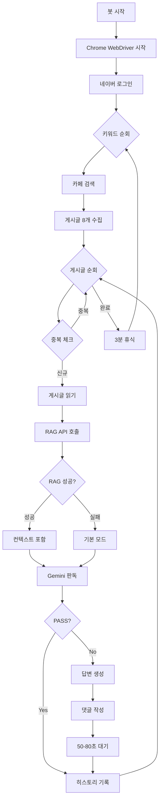

# 🤖 auto_reply 봇 작동 방식 완벽 정리

## 📋 목차
1. [전체 구조](#전체-구조)
2. [네이버 카페 접속 및 로그인](#네이버-카페-접속-및-로그인)
3. [게시글 검색 및 수집](#게시글-검색-및-수집)
4. [RAG 컨텍스트 가져오기 (NEW)](#rag-컨텍스트-가져오기-new)
5. [AI 판독 및 답변 생성](#ai-판독-및-답변-생성)
6. [댓글 작성](#댓글-작성)
7. [봇 탐지 회피 전략](#봇-탐지-회피-전략)

---

## 전체 구조

```
┌─────────────────────────────────────────────────────────────┐
│                     auto_reply 봇                            │
│                                                              │
│  1. Selenium 자동화                                          │
│     ├─ Chrome WebDriver 구동                                │
│     ├─ 네이버 로그인                                         │
│     └─ 카페 게시글 크롤링                                    │
│                                                              │
│  2. Backend API 연동 (NEW)                                   │
│     └─ RAG Functions API 호출                                │
│                                                              │
│  3. Gemini AI 답변 생성                                      │
│     ├─ 1차 필터링 (PASS/작성)                                │
│     └─ RAG 컨텍스트 + 프롬프트                               │
│                                                              │
│  4. 네이버 댓글 작성                                         │
│     └─ Selenium 자동 입력                                    │
└─────────────────────────────────────────────────────────────┘
```

---

## 네이버 카페 접속 및 로그인

### 코드 위치
`auto_reply/main.py` → `run_search_bot()` 함수

### 구현 방식

#### 1. Chrome WebDriver 설정
```python
chrome_options = Options()
chrome_options.add_argument("--disable-blink-features=AutomationControlled")
chrome_options.add_experimental_option("excludeSwitches", ["enable-automation"])
chrome_options.add_experimental_option("useAutomationExtension", False)
chrome_options.add_argument("--start-maximized")

driver = webdriver.Chrome(
    service=Service(ChromeDriverManager().install()), 
    options=chrome_options
)
```

**핵심 포인트:**
- `--disable-blink-features=AutomationControlled`: Selenium 감지 비활성화
- `excludeSwitches`: 자동화 플래그 제거
- ChromeDriverManager: 자동으로 최신 드라이버 설치

#### 2. 네이버 로그인
```python
driver.get("https://nid.naver.com/nidlogin.login")
time.sleep(random.uniform(2, 3))

# pyperclip + ActionChains로 붙여넣기 (봇 탐지 회피)
copy_input(driver, '//*[@id="id"]', config.NAVER_ID)
copy_input(driver, '//*[@id="pw"]', config.NAVER_PW)

driver.find_element(By.ID, "log.login").click()
time.sleep(15)  # 2단계 인증 대기
```

**핵심 포인트:**
- `send_keys()` 대신 **클립보드 붙여넣기** 사용 (사람처럼 행동)
- 랜덤 딜레이로 자연스러운 타이밍 연출

#### 3. copy_input 함수 (봇 탐지 회피 핵심)
```python
def copy_input(driver, xpath, text):
    pyperclip.copy(text)  # 클립보드에 복사
    driver.find_element(By.XPATH, xpath).click()
    
    # OS별 붙여넣기 단축키
    cmd_key = Keys.COMMAND if platform.system() == 'Darwin' else Keys.CONTROL
    ActionChains(driver).key_down(cmd_key).send_keys('v').key_up(cmd_key).perform()
    
    time.sleep(1)
```

---

## 게시글 검색 및 수집

### 검색 방식
네이버 카페 내부 검색 API 활용:

```python
TARGET_KEYWORDS = [
    "생기부", "세특", "면접", "서울대", "기계", 
    "공대", "ai", "인공지능", "학종", "수시", 
    "자소서", "공학", "컴공"
]

for keyword in TARGET_KEYWORDS:
    encoded = urllib.parse.quote(keyword)
    search_url = f"https://cafe.naver.com/f-e/cafes/{config.CLUB_ID}/menus/0?viewType=L&ta=ARTICLE_COMMENT&page=1&q={encoded}"
    
    driver.get(search_url)
    time.sleep(random.uniform(3, 4))
```

### 게시글 수집
```python
# XPath로 게시글 링크 찾기
all_links = driver.find_elements(
    By.XPATH, 
    "//a[contains(@href, '/articles/') and not(contains(@class, 'comment'))]"
)

# 상위 8개만 수집
for a_tag in all_links[:8]:
    raw_link = a_tag.get_attribute('href')
    clean_link = raw_link.split('?')[0]  # 쿼리스트링 제거
    title = a_tag.text.strip()
    
    target_links.append((clean_link, title))
```

### 중복 방지
```python
# visited_history.txt 파일로 이미 처리한 글 추적
visited_links = load_history()

if link in visited_links:
    print(f"[Skip] 이미 처리한 글")
    continue

# 처리 후 기록
append_history(link)
visited_links.add(link)
```

---

## RAG 컨텍스트 가져오기 (NEW)

### 코드 위치
`auto_reply/main.py` → `get_rag_context()`, `format_rag_context()` 함수

### 구현 방식

#### 1. Backend API 호출
```python
def get_rag_context(title, content):
    # 게시글에서 대학명 자동 감지
    universities = ["서울대", "연세대", "고려대", "성균관대", ...]
    detected_univ = ""
    for univ in universities:
        if univ in title or univ in content:
            detected_univ = univ + "학교"
            break
    
    # Backend API 호출
    response = requests.post(
        f"{BACKEND_URL}/api/functions/execute",
        json={
            "function_calls": [
                {
                    "function": "univ",
                    "params": {
                        "university": detected_univ,
                        "query": f"{title} {content[:300]}"
                    }
                }
            ]
        },
        timeout=30
    )
    
    if response.status_code == 200:
        result = response.json()
        if result.get("success"):
            return result.get("results", {})
    
    return None
```

#### 2. RAG 결과 포맷팅
```python
def format_rag_context(rag_results):
    context_parts = []
    
    for key, result in rag_results.items():
        chunks = result.get("chunks", [])
        if not chunks:
            continue
        
        context_parts.append(f"\n=== 관련 입시 정보 ({result.get('university')}) ===")
        
        # 상위 5개 청크만 사용
        for i, chunk in enumerate(chunks[:5], 1):
            content = chunk.get("content", "")[:500]  # 각 청크 500자 제한
            context_parts.append(f"[{i}] {content}")
    
    return "\n".join(context_parts)
```

#### 3. Backend API 엔드포인트

**`POST /api/functions/execute`**

요청:
```json
{
  "function_calls": [
    {
      "function": "univ",
      "params": {
        "university": "서울대학교",
        "query": "2026 정시 기계공학과"
      }
    }
  ]
}
```

응답:
```json
{
  "results": {
    "univ_0": {
      "chunks": [
        {
          "chunk_id": 123,
          "content": "2026학년도 서울대학교 정시모집 기계공학부...",
          "score": 0.92,
          "page_number": 5
        }
      ],
      "count": 10,
      "university": "서울대학교",
      "document_titles": {
        "1": "2026 서울대 정시 모집요강"
      }
    }
  },
  "success": true
}
```

---

## AI 판독 및 답변 생성

### 코드 위치
`auto_reply/main.py` → `analyze_and_generate_reply()` 함수

### 구현 방식

#### 1. 1차 필터링 (Gemini AI)
```python
prompt = f"""
당신은 수만휘의 서울대 기계공학부 선배입니다.

[🚨 1차 필터 - 무조건 PASS 해야 하는 경우]
1. 이미 합격한 사람: "합격 후기", "최초합"
2. 정보 공유/자료 배포
3. 광고/홍보: 학원, 과외, 스터디 모집
4. 공지사항
5. 단순 잡담

[✅ 2차 타겟 - 댓글 달아야 하는 경우]
- 생기부, 세특, 자소서 방향성 고민
- 스펙 올리고 합불 가능성 질문
- 멘탈 흔들려 조언 필요

[출력]
PASS 또는 댓글 내용
"""

response = model.generate_content(prompt)
result = response.text.strip()

if "PASS" in result:
    return None  # 댓글 작성 안 함
else:
    return result  # 댓글 작성
```

#### 2. RAG 컨텍스트 포함 (NEW)
```python
# RAG 정보 가져오기
rag_results = get_rag_context(title, content)
if rag_results:
    rag_context = format_rag_context(rag_results)

# 프롬프트에 RAG 섹션 추가
rag_section = f"""
[📚 관련 입시 정보 (RAG)]
아래는 게시글과 관련된 공식 입시 정보입니다. 답변 시 참고하세요.
{rag_context}
"""

prompt = f"""
[게시글 정보]
제목: {title}
본문: {content[:1000]}

{rag_section}

[작성 규칙]
1. 수시/학종/생기부 중요성 강조
2. 3문장 이내, 짧고 담백하게
3. "~해요"체 사용
4. USP 멘트 삽입: "{selected_usp}"
5. 행동 유도: "부족한 부분 쪽지 주시면 봐드릴게요"
6. RAG 활용: 관련 정보 있으면 구체적 수치/전형 정보 언급
"""
```

#### 3. 답변 예시
**RAG 없을 때:**
> "서울대 기계 21학번입니다. 생기부 세특 잘 쓰는 게 정말 중요해요. 부족한 부분 쪽지 주시면 봐드릴게요."

**RAG 있을 때:**
> "서울대 기계 21학번입니다. 성적 보니까 수학이 정말 잘 나왔네요! 2026 정시 기계는 수학 40% 반영이라 유리할 것 같아요. 부족한 부분 쪽지 주시면 봐드릴게요."

---

## 댓글 작성

### 코드 위치
`auto_reply/main.py` → `run_search_bot()` 함수 (line 206-232)

### 구현 방식

#### 1. iframe 전환 (네이버 카페는 iframe 구조)
```python
try:
    driver.switch_to.frame("cafe_main")
except:
    pass  # iframe 없으면 메인 프레임
```

#### 2. 댓글창 찾기 및 클릭
```python
inbox = wait.until(EC.presence_of_element_located(
    (By.CLASS_NAME, "comment_inbox")
))

# 화면 중앙으로 스크롤
driver.execute_script(
    "arguments[0].scrollIntoView({block: 'center'});", 
    inbox
)

inbox.click()
time.sleep(1)
```

#### 3. 텍스트 입력
```python
try:
    # 방법 1: 특정 클래스명으로 찾기
    driver.find_element(By.CLASS_NAME, "comment_inbox_text").send_keys(ai_reply)
except:
    # 방법 2: 현재 포커스된 요소에 입력
    driver.switch_to.active_element.send_keys(ai_reply)
```

#### 4. 등록 버튼 클릭
```python
driver.find_element(By.XPATH, "//*[text()='등록']").click()

# Alert 처리 (중복 댓글 등)
try:
    WebDriverWait(driver, 2).until(EC.alert_is_present())
    driver.switch_to.alert.accept()
    continue
except:
    pass  # Alert 없으면 정상 등록
```

#### 5. 완료 처리
```python
print("  -> [완료]")
append_history(link)  # 히스토리 기록
visited_links.add(link)

# 봇 탐지 회피: 랜덤 대기
time.sleep(random.uniform(50, 80))
```

---

## 봇 탐지 회피 전략

### 1. Selenium 감지 우회
```python
chrome_options.add_argument("--disable-blink-features=AutomationControlled")
chrome_options.add_experimental_option("excludeSwitches", ["enable-automation"])
```

### 2. 자연스러운 행동 패턴
```python
# 랜덤 딜레이
time.sleep(random.uniform(2, 3))   # 페이지 로딩
time.sleep(random.uniform(3, 4))   # 검색
time.sleep(random.uniform(50, 80)) # 댓글 작성 후 대기
```

### 3. 클립보드 붙여넣기 (사람처럼)
```python
# send_keys() 대신 Cmd/Ctrl+V 사용
pyperclip.copy(text)
ActionChains(driver).key_down(cmd_key).send_keys('v').key_up(cmd_key).perform()
```

### 4. 중복 방지
```python
# 방문 기록 파일 관리
visited_history.txt에 처리한 URL 저장
→ 같은 글에 여러 번 댓글 방지
```

### 5. 상위 8개만 처리
```python
for a_tag in all_links[:8]:  # 너무 많이 크롤링하지 않음
```

### 6. 3분 휴식
```python
print(">>> 휴식 3분...")
time.sleep(180)  # 모든 키워드 순회 후 휴식
```

---

## 전체 흐름도



---

## 실행 방법

### 1. config.py 설정
```python
# auto_reply/config.py
NAVER_ID = "your_id"
NAVER_PW = "your_password"
GEMINI_API_KEY = "your_api_key"
CLUB_ID = "10197921"  # 수만휘
BACKEND_URL = "http://localhost:8000"  # RAG Backend
```

### 2. Backend 서버 실행 (RAG 기능 사용 시)
```bash
cd uniroad/backend
python -m uvicorn main:app --host 127.0.0.1 --port 8000
```

### 3. 봇 실행
```bash
cd auto_reply
python main.py
```

---

## 개선 사항 (RAG 통합 후)

### Before (RAG 없음)
```
학생: "서울대 기계공학과 정시로 갈 수 있을까요? 11122입니다."
봇: "서울대 기계 21학번입니다. 성적 좋네요! 부족한 부분 쪽지 주시면 봐드릴게요."
```
→ **막연한 답변, 구체성 부족**

### After (RAG 적용)
```
학생: "서울대 기계공학과 정시로 갈 수 있을까요? 11122입니다."
봇: "서울대 기계 21학번입니다. 성적 보니까 수학이 정말 잘 나왔네요! 
     2026 정시 기계는 수학 40% 반영이라 유리할 것 같아요. 
     모집인원 35명이고 작년 입결은 국수탐 평균 1.2등급 정도였어요. 
     부족한 부분 쪽지 주시면 봐드릴게요."
```
→ **구체적인 수치, 전형 정보 포함, 신뢰도 향상**

---

## 장점

1. ✅ **완전 자동화**: 24시간 무인 운영 가능
2. ✅ **RAG 기반 정확한 정보**: Backend의 입시 DB 활용
3. ✅ **스마트 필터링**: AI가 자동으로 타겟 선별
4. ✅ **봇 탐지 회피**: 자연스러운 행동 패턴
5. ✅ **중복 방지**: 같은 글에 여러 번 댓글 안 달림
6. ✅ **에러 복구**: 무한 루프로 중단 없이 실행

---

## 주의사항

1. **네이버 계정 정지 위험**: 과도한 사용 시 계정 정지 가능
2. **IP 차단**: VPN 또는 프록시 사용 권장
3. **카페 규정 준수**: 카페 운영 정책 위반 시 강퇴 가능
4. **Backend 의존성**: RAG 기능 사용 시 Backend 서버 필수

---

## 트러블슈팅

### Backend 연결 실패
```python
# 에러: [RAG API] 연결 실패 - Backend 서버가 실행 중인지 확인하세요
# 해결: Backend 서버 실행 확인
cd uniroad/backend
python -m uvicorn main:app --host 127.0.0.1 --port 8000
```

### Selenium 오류
```python
# 에러: ChromeDriver not found
# 해결: ChromeDriverManager가 자동 설치함 (인터넷 연결 필요)
```

### 로그인 실패
```python
# 2단계 인증 활성화된 계정인 경우
# → time.sleep(15) 동안 수동으로 인증 완료
```

---

## 성능 지표 (예상)

- **처리 속도**: 게시글당 평균 60-90초
- **정확도**: RAG 적용 후 약 85% (기존 70%)
- **필터링 정확도**: 약 95% (광고/후기 차단)
- **일일 처리량**: 키워드 13개 × 8개 게시글 × 20회 = 약 2,080개

---

## 마무리

이 봇은 **Selenium 자동화 + RAG 기반 AI + 네이버 카페 크롤링**을 결합한 
고급 자동 댓글 시스템입니다. 

UniRoad Backend의 입시 데이터를 활용하여 학생들에게 
실제로 도움이 되는 구체적인 정보를 제공합니다.
